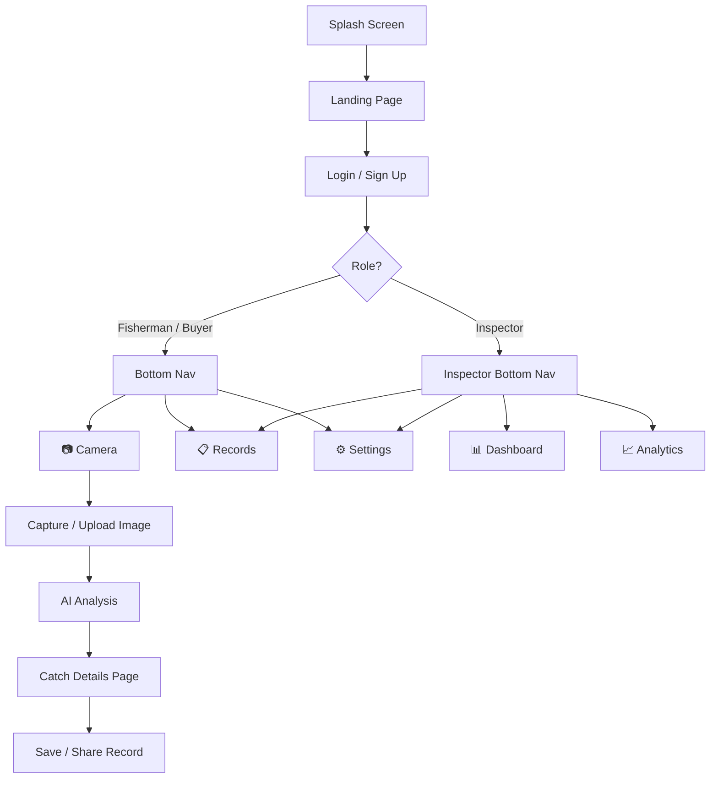

<p align="center">
  
  
  
  
  
</p>

<h1 align="center">🐟 Aqua Setu</h1>

<p align="center">
  <b>AI-Powered Fish Catch Identification, Health Assessment & Volume Estimation</b><br/>
  <i>Know Your Catch — Instantly.</i>
</p>

<p align="center">
  
  
  
  
</p>

---

## 📖 Overview

**Aqua Setu** is an offline-capable Android application built with Flutter that empowers fishermen, inspectors, and buyers in maritime domains to instantly:

- 🐠 **Identify fish species** from a set of known Indian species using on-device AI
- 🩺 **Assess freshness & quality** with health grading (Excellent / Good / Fair)
- ⚖️ **Estimate weight & volume** from captured images using depth sensing
- 📍 **Geotag every scan** with GPS coordinates and timestamps for full traceability
- 📊 **Track & manage catch records** with local storage, search, and export

All AI inference runs **entirely on-device** — no internet connection required.

---

## ✨ Key Features

### 🎯 Multi-Role System
| Role | Access |
|------|--------|
| **Fisherman** | Camera scan, catch records, settings |
| **Buyer** | Same as fisherman — verify catch quality before purchase |
| **Inspector** | Dashboard, analytics, compliance alerts, records audit |

### 📷 Smart Camera Capture
- **Open Camera** or **Upload from Gallery**
- Automatic GPS geotagging on every capture
- Edge AI processing indicator showing active models

### 🧠 On-Device AI Pipeline
| Component | Model | Purpose |
|-----------|-------|---------|
| Detection | YOLOv8-Tiny | Real-time fish detection & counting |
| Classification | EfficientNet-Lite / MobileNetV3 | Species identification |
| Health Assessment | Custom CNN | Freshness & quality grading |
| Volume Estimation | ARCore / Dual-Camera | Weight estimation via depth sensing |

### 📊 Catch Analysis Results
- Species name with count (e.g., *Pomfret × 12*)
- Freshness grade with percentage (e.g., *Grade A — 92%*)
- AI confidence score for each prediction
- Batch weight estimation
- Geo-coordinates display
- Save & share analysis reports

### 📋 Records Management
- **Local SQLite database** of all scanned catches
- Search by species name
- Filter by quality: All / Excellent / Good / Fair
- Summary statistics (total scans, fish count, total weight)
- **Export to CSV** and **Share Data** options
- Per-record species breakdown with health status

### 🛡️ Inspector Mode
- **Dashboard** — Today's overview with live stats:
  - Inspections count, Approved / Failed QC / Pending
  - Recent alerts (Expired catch, Unverified IDs, Low health scores)
- **Analytics** — Futuristic glassmorphism UI:
  - Total inspections, unsynced records, avg health score, total weight
  - Top species breakdown by period
  - Alert summary for the last 7 days

### ⚙️ Configurable Settings
- **AI Model Quality** — Balanced / High Accuracy / Low Power modes
- **Confidence Threshold** — Adjustable slider (1–100%)
- **Offline Mode** — Run entirely on-device
- **GPS Geotagging** — Toggle location data for scans
- **Auto Cloud Sync** — Sync when internet is available
- **Species Database** — 52 Indian species, with update capability
- **System Status** — AI models loaded, local DB ready, GPS active, encryption status

---

## 🏗️ Project Architecture

```
lib/
├── main.dart                        # App entry point & splash screen
├── screens/
│   ├── landing_page.dart            # Hero landing page with background image
│   ├── login_signup_screen.dart     # Login / Sign Up with role selection
│   ├── role_selection_page.dart     # Fisherman/Buyer vs Inspector chooser
│   ├── camera_page.dart            # Camera capture with GPS geotagging
│   ├── details_page.dart           # Catch analysis results display
│   ├── records_screen.dart         # Local catch records with search & filter
│   ├── setting_screen.dart         # App settings & AI model configuration
│   ├── inspector_dashboard.dart    # Inspector overview with stats & alerts
│   ├── inspector_analytics.dart    # Inspector analytics with glassmorphism UI
│   └── inspector_bottom_nav.dart   # Inspector-specific bottom navigation
├── widgets/
│   ├── bottom_nav.dart             # Fisherman/Buyer bottom navigation
│   ├── hero_background.dart        # Reusable hero background widget
│   └── scan_screen.dart            # Scan screen widget
└── utils/
    ├── app_colors.dart             # App color palette
    └── app_text-styles.dart        # Text style definitions
```

---

## 🚀 Getting Started

### Prerequisites

- [Flutter SDK](https://docs.flutter.dev/get-started/install) `>= 3.10.1`
- [Android Studio](https://developer.android.com/studio) or VS Code with Flutter extension
- Android device or emulator (API 21+)
- Git

### Installation

```bash
# 1. Clone the repository
git clone https://github.com/<your-username>/AquaSetu.git
cd AquaSetu

# 2. Install dependencies
flutter pub get

# 3. Run the app
flutter run
```

### Build APK

```bash
# Debug APK
flutter build apk --debug

# Release APK
flutter build apk --release
```

---

## 📱 App Flow



---

## 🧠 AI Models Overview

| Model | Architecture | Task | Deployment |
|-------|-------------|------|------------|
| Fish Detector | YOLOv8-Tiny | Object detection & counting | TensorFlow Lite |
| Species Classifier | EfficientNet-Lite / MobileNetV3 | Species identification | TensorFlow Lite |
| Health Assessor | Custom CNN | Freshness / quality grading | TensorFlow Lite |
| Volume Estimator | ARCore + Dual Camera | Depth-based weight estimation | ARCore SDK |

**Model quality presets:**
- 🟢 **Balanced** — YOLOv8-Tiny + EfficientNet-Lite (recommended)
- 🔵 **High Accuracy** — Larger models, slower inference
- 🟡 **Low Power** — Smallest models, fastest inference

---

## 📦 Dependencies

| Package | Version | Purpose |
|---------|---------|---------|
| `flutter` | SDK | Core framework |
| `cupertino_icons` | ^1.0.8 | iOS-style icons |
| `lottie` | ^3.3.2 | Animated illustrations |
| `provider` | ^6.0.5 | State management |
| `http` | ^1.2.3 | HTTP networking (cloud sync) |
| `flutter_lints` | ^6.0.0 | Code quality linting |

---

## 🎯 Use Cases

| Stakeholder | Use Case |
|------------|----------|
| 🎣 **Fishermen** | Instant species ID, digital catch records for better pricing |
| 🛒 **Buyers** | Verify catch quality and freshness before purchase |
| 🛡️ **Inspectors** | Enforce fishing quotas, monitor sustainability, audit compliance |
| 🌍 **Exporters** | Traceability records with geo-coordinates & timestamps |
| 🏛️ **Regulators** | Data-driven fisheries management and conservation |

---

## 🛣️ Roadmap

- [x] Multi-role authentication (Fisherman, Buyer, Inspector)
- [x] Camera capture with GPS geotagging
- [x] AI pipeline UI integration (YOLOv8 + EfficientNet + CNN)
- [x] Catch analysis results display
- [x] Records management with search, filter & export
- [x] Inspector dashboard with alerts
- [x] Inspector analytics with glassmorphism UI
- [x] Configurable AI model settings
- [x] Offline-first architecture
- [ ] Live TFLite model integration for real-time inference
- [ ] ARCore depth sensing for volume estimation
- [ ] SQLite database persistence
- [ ] Cloud sync to government/market systems
- [ ] Multi-language support (Hindi, Marathi, Tamil, etc.)
- [ ] Scalability to other aquatic species (shrimp, crab, lobster)

---

## 🤝 Contributing

Contributions are welcome! Please follow these steps:

1. **Fork** the repository
2. **Create** a feature branch (`git checkout -b feature/amazing-feature`)
3. **Commit** your changes (`git commit -m 'Add amazing feature'`)
4. **Push** to the branch (`git push origin feature/amazing-feature`)
5. **Open** a Pull Request

---

## 📄 License

This project is licensed under the MIT License — see the [LICENSE](LICENSE) file for details.

---

<p align="center">
  Made with ❤️ for sustainable fisheries<br/>
  <b>Aqua Setu</b> — Bridging Technology & Maritime Livelihoods
</p>
